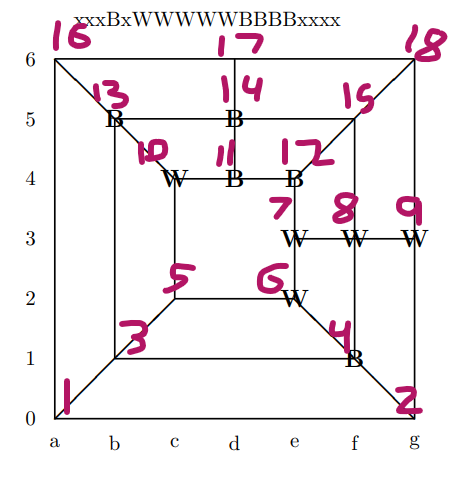

# Morris Solver
### An "AI" solver for a Morris game variant
### Christian Duffee (cbd170000)
### Dr. Haim Schweitzer CS 6364.OU1 

If you do not have a markdown reader, please view at https://github.com/champfish/Morris



## Run instructions
These eight programs require a C++17 environment. With g++ installed, one can be run using the following command.
```
g++ -std=c++17 PROGRAM_NAME -o EXECUTABLE_NAME && ./EXECUTABLE_NAME INPUT_FILE_NAME OUTPUT_FILE_NAME DEPTH
```
For example, to run ABGame.cpp with input from board1.txt at a ply depth of 3 with an output file of board2.txt, the following command would be run
```
g++ -std=c++17 ABGame.cpp -o ABGame.out && ./ABGame.out board1.txt board2.txt 3
```

## MiniMaxOpening.cpp
This program uses the MiniMax method to generate a move for white during the opening phase of Morris: where pieces are added to the board. The static estimate is the difference in number of white and black pieces. 

### Example
``` 
Input: xxxxxxxxxxxxxxxxxx
Depth: 5
==================================
Board Position: Wxxxxxxxxxxxxxxxxx
Positions evaluated by static estimation: 1042860
MINIMAX estimate: 1
```

## MiniMaxGame.cpp
This program uses the MiniMax method to generate a move for white after the opening phase. In this phase pieces are either moved, or hopped between spots on the board. The static estimate is 1000\*( difference in number of white and black pieces)-(# of possible black moves). 

### Example
``` 
Input: xWBBBBxWxWxxWBWWBx
Depth: 5
==================================
Board Position: xWBBBBxWxWxxWBxWBW
Positions evaluated by static estimation: 23596
MINIMAX estimate: 994
```

## ABOpening.cpp
This program is the exact same as MiniMaxOpening.cpp, except that it uses alpha-beta pruning to reduce the number of nodes that need processing. This will not effect the results. This can be seen in the following example, which uses the same input as the example for MiniMaxOpening.cpp.
### Example
``` 
Input: xxxxxxxxxxxxxxxxxx
Depth: 5
==================================
Board Position: Wxxxxxxxxxxxxxxxxx
Positions evaluated by static estimation: 10036
MINIMAX estimate: 1
```

## ABGame.cpp
This program is the exact same as MiniMaxGame.cpp, except that it uses alpha-beta pruning to reduce the number of nodes that need processing. This can be seen in the following example, which uses the same input as the example for MiniMaxGame.cpp.
### Example
``` 
Input: xWBBBBxWxWxxWBWWBx
Depth: 5
==================================
Board Position: xWBBBBxWxWxxWBxWBW
Positions evaluated by static estimation: 2397
MINIMAX estimate: 994
```

## MiniMaxOpeningBlack.cpp
This program uses the MiniMax method to generate a move for black during the opening phase of Morris: where pieces are added to the board. This program works identically to MiniMaxOpening.cpp, except the colors being read in and written out are swapped.

### Example
``` 
Input: xxxxxxxxxxxxxxxxxx
Depth: 5
==================================
Board Position: Bxxxxxxxxxxxxxxxxx
Positions evaluated by static estimation: 1042860
MINIMAX estimate: 1
```

## MiniMaxGameBlack.cpp
This program uses the MiniMax method to generate a move for black after the opening phase. This program works identically to MiniMaxGame.cpp, except the colors being read in and written out are swapped. Note that a different number of postions are evaluated due to the asymmetry between the number of moves each color can make. 

### Example
``` 
Input: xWBBBBxWxWxxWBWWBx
Depth: 5
==================================
Board Position: BWxBBBxWxWxxWBWWBx
Positions evaluated by static estimation: 15347
MINIMAX estimate: -11
```

## MiniMaxOpeningImproved.cpp
This program is identical to MiniMaxOpening.cpp except for the fact the static estimate function has been changed. The new static estimate function is twice the difference between number of white and black pieces, plus the difference between the number of white and black incomplete mills (with 2/3 pieces placed). This is an improvement over the previous static estimate function because it allows the player to set up possible future mills without exploring additional depths. For instance, its very easy to estimate that having a 2/3 completed mill might result in an eventual future mill completing even if the probably completion of the mill is beyond the horizon, and thus not considered by the old algorithm. 

As shown in example 1 below, this allows the white player to prioritize setting up a mill on space 1, 3, and 5 as opposed to just blindly placing a piece on spot 2. 
### Example 1 (MiniMaxOpening.cpp)
``` 
Input: WxxxxxxxxxxxxxxxxB
Depth: 1
==================================
Board Position: WWxxxxxxxxxxxxxxxB
Positions evaluated by static estimation: 16
MINIMAX estimate: 1
```
### Example 1 (MiniMaxOpeningImproved.cpp)
``` 
Input: WxxxxxxxxxxxxxxxxB
Depth: 1
==================================
Board Position: WxWxxxxxxxxxxxxxxB
Positions evaluated by static estimation: 16
MINIMAX estimate: 3
```
### Example 2 (MiniMaxOpeningImproved.cpp)
Note this produces a different move than the same input shown in the MiniMaxOpening.cpp section.
``` 
Input: xxxxxxxxxxxxxxxxxx
Depth: 5
==================================
Board Position: xWxxxxxxxxxxxxxxxx
Positions evaluated by static estimation: 1042860
MINIMAX estimate: 3
```

## MiniMaxGameImproved.cpp
This program is identical to MiniMaxGame.cpp except with a similar modified static estimate function as MiniMaxOpeningImproved.cpp. The only difference is that the incomplete mills count for 1000 each while the pieces count for 2000 each maintaining the same ratio as MiniMaxOpeningImproved.cpp. This ratio is somewhat arbitrary and empirical testing should be done to determine a more accurate ratio equivalence between incomplete mills and pieces. I theorize that this ratio will change with the number of pieces on the board as well; it is harder to move a piece to complete a mill if the board is sufficiently crowded with enemy pieces.

As shown in example 1, this allows the white player to prioritize setting up a mill on space 16, 17, and 18 as opposed to just blindly moving a piece from spot 1 to spot 2. 
### Example 1 (MiniMaxGame.cpp)
``` 
Input: WBxxxWWxxxxBxxBxxW
Depth: 1
==================================
Board Position: xBWxxWWxxxxBxxBxxW
Positions evaluated by static estimation: 7
MINIMAX estimate: 967
```
### Example 1 (MiniMaxGameImproved.cpp)
``` 
Input: WBxxxWWxxxxBxxBxxW
Depth: 1
==================================
Board Position: xBxxxWWxxxxBxxBWxW
Positions evaluated by static estimation: 7
MINIMAX estimate: 2967
```
### Example 2 (MiniMaxGameImproved.cpp)
Note this produces a different move than the same input shown in the MiniMaxGame.cpp section.
``` 
Input: xWBBBBxWxWxxWBWWBx
Depth: 5
==================================
Board Position: WWBBBBxWxWxxWBWxBx
Positions evaluated by static estimation: 23596
MINIMAX estimate: 2991
```